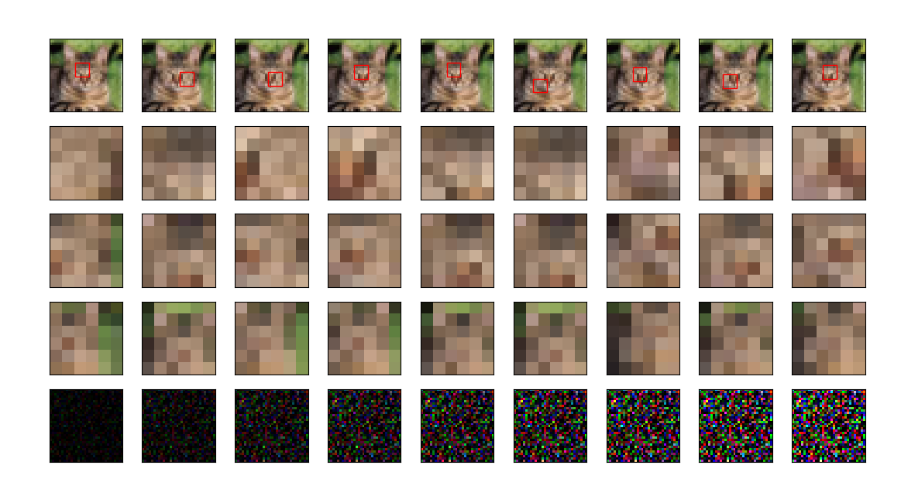

# Unsupervied Recurrent Visual Attention

## Model Description

This model is an unsupervised attention model where the unsupervised learning is done using the autoencoder network and the learning of where to look next is done using RNN and Reinforcement learning.

- **glimpse sensor**: a retina that extracts a foveated glimpse `phi` around location `l` from an image `x`. It encodes the region around `l` at a high-resolution but uses a progressively lower resolution for pixels further from `l`, resulting in a compressed representation of the original image `x`.
- **glimpse network**: a network that combines the "what" (`phi`) and the "where" (`l`) into a glimpse feature vector`g_t`.
- **core network**: an RNN that maintains an internal state that integrates information extracted from the history of past observations. It encodes the agent's knowledge of the environment through a state vector `h_t` that gets updated at every time step `t`.
- **location network**: uses the internal state `h_t` of the core network to produce the location coordinates `l_t` for the next time step.
- **Auto Encoder network**: at each time step it predicts the output image from the hidden layer output and is the cummulative sum of the previouse time step output images.

## Results

I decided to tackle the `32x32` Cifae-10 task with the RAM model containing 9 glimpses, of size `6x6`, with a scale factor of `2`.

<p align="center">
 
</p>

 -Here in the first row it shows the bounding box of size*size (here in
this case it is 6*6) at the location where it is looking.
 - In the second row it shows the extracted patch of size*size (here 6*6)
 - In third row it is a scaled down version of (scale*size)*(scale*size) patch centered at the locations of the glimpse to size*size patch (here
scale = 2 so 12*12 patch to 6*6 patch)
 - In fourth row it is a scaled down version of (scale​ 2​ *size)*(scale​ 2​ *size) patch centered at the locations of the glimpse to size*size patch (here
scale = 2 so 24*24 patch to 6*6 patch)
 - Last row is the cumulative sum of predicted image at each at each glimpse. (​ Note: This output result is the output of the 1st epoch
hence very noisy results of the predicted image​ )


## Requirements

- python 3.5+
- pytorch 0.3+
- tensorboard_logger
- tqdm

## Usage

The easiest way to start training your RAM variant is to edit the parameters in `config.py` and run the following command:

```
python3 main.py
```

For seeing the glimpses results:

```
python3 plot_glimpses.py --plot_dir=PATH_TO_THE_PLOT_DIR --epoch=EPOCH_NUMBER
```

E.g. 
```
python3 plot_glimpses.py --plot_dir=./ram_9_6x6_2/ --epoch=1
```
Here the data while training is saved for each epoch in the plot/ directory with model name as : ram_NO_OF_GLIPMSES_SIZE*SIZE_SCALE.

Here different different data is saved for each epoch like locations as l_EPOCH_NO, glimpses data as gp_EPOCH_NO, formed images, and original images.
To see the results we can parallelly see the output by running the above command after that particular epoch is done.

Finally, to test a checkpoint of your model that has achieved the best validation accuracy, run the following command:

```
python3 main.py --is_train=False --model_epoch=PRETRAINED_SAVED_MODEL_EPOCH_NO
```
E.g. : 
```
python3 main.py --is_train=false --model_epoch=9
```

Enter only that epoch number for which there is available in the ckpt directory.

## References

- [Torch Blog Post on RAM](http://torch.ch/blog/2015/09/21/rmva.html)
